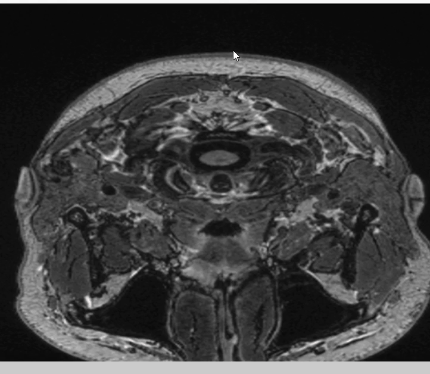

### Update on  13.09.2025 - 19.09.2025:

### Dutch Support 

  

### Update on August:

### Polygon Edit

  
### Polygon Edit

  
### Scroller For Slices

  
### Bounding Box + Red Cross Cursor

   
### Polygon Drawing

