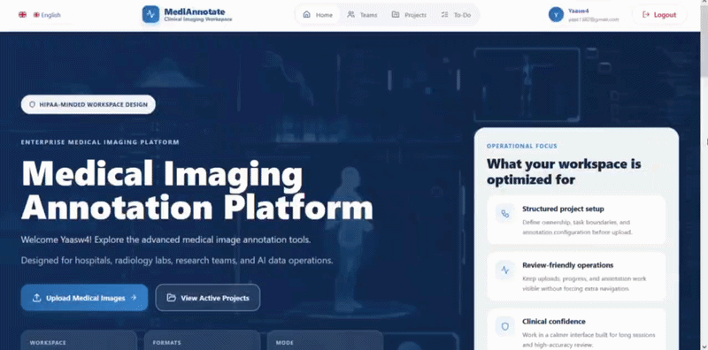
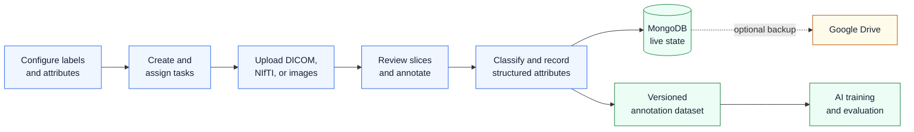
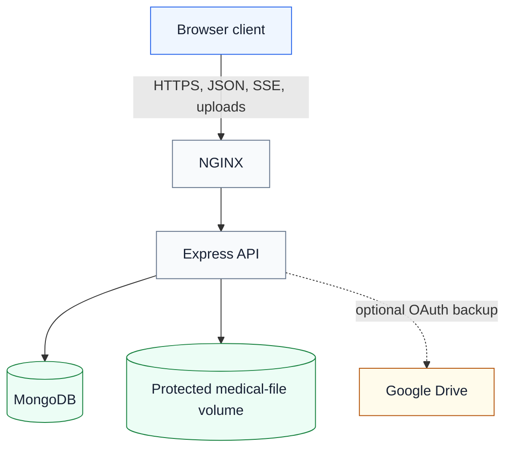

<div align='center'>

# Medical Image Annotation Platform

**Secure clinical image review, collaborative annotation, and traceable dataset creation in one web workspace.**

<p>
  <code>DICOM</code>
  <code>NIfTI</code>
  <code>React</code>
  <code>Node.js</code>
  <code>MongoDB</code>
  <code>Docker</code>
</p>

<p>
  <a href='#capabilities'>Capabilities</a> |
  <a href='#data-for-machine-learning'>ML Data</a> |
  <a href='#workflow'>Workflow</a> |
  <a href='#quick-start'>Quick Start</a> |
  <a href='#security'>Security</a>
</p>


</div>

---

> [!IMPORTANT]
> **Active development.** This repository provides a production-shaped application and deployment foundation. Complete the controls in [SECURITY.md](SECURITY.md) before processing patient data.

## At A Glance

| Medical input | Annotation workspace | Dataset output | Platform |
| :---: | :---: | :---: | :---: |
| DICOM series<br>NIfTI volumes<br>PNG and JPEG | Five drawing tools<br>Three anatomical views<br>Slice-level review | Versioned JSON<br>One-based slices<br>Image-pixel geometry | Four languages<br>Team workflows<br>Docker deployment |

## Capabilities

| Area | What the platform provides |
| --- | --- |
| **Medical review** | Axial, coronal, and sagittal viewing; slice navigation; window center/width; region zoom; overlay controls |
| **Annotation** | Bounding boxes, polygons, polylines, ellipses, brush masks, editable vertices, labels, and classifications |
| **Structured data** | Project-defined attributes, standardized geometry, schema versions, revision metadata, provenance, and integrity hashes |
| **Operations** | Projects, tasks, priorities, progress, subsets, owners, assignees, timers, labels, and attribute schemas |
| **Collaboration** | User and team assignment, realtime update notices, per-file/per-slice persistence, and unsaved-change protection |
| **Localization** | English, German, Dutch, and Persian, including right-to-left layout support |
| **Storage** | MongoDB as the live source of truth with optional Google Drive backup for files, snapshots, and exports |
| **Deployment** | Local Node.js development, Docker Compose, and multi-architecture GitHub Container Registry publishing |

## Data For Machine Learning

The platform captures structured final-state supervision for dataset curation, quality review, supervised learning, and imitation-learning research.

| Signal | Captured data |
| --- | --- |
| **Geometry** | Shape type, image-pixel coordinates, dimensions, and slice number |
| **Semantics** | Annotation label, slice classification, and project-defined attributes |
| **Context** | Project, task, medical file, and slice |
| **Provenance** | Creator, last editor, timestamps, revision, schema version, and SHA-256 integrity |
| **Effort** | Per-user task session time |

> [!NOTE]
> The current system captures annotation outcomes and timing. It does not record every pointer movement or keyboard action as an action trajectory.

Saved slices use the versioned `medical-image-annotation.v1` schema and one-based indexing:

```yaml
1:
  schemaVersion: medical-image-annotation.v1
  sliceNumber: 1
  sliceIndexBase: 1
  coordinateSystem: image-pixel
  annotations: []
  classification:
    value: positive
    scope: slice
  attributes: {}
```

## Workflow



## Architecture



| Layer | Responsibility |
| --- | --- |
| **React client** | Clinical workspace, medical viewers, project workflows, and localization |
| **Express API** | Authentication, authorization, validation, audit logging, collaboration events, and protected file access |
| **MongoDB** | Live users, projects, tasks, teams, timers, annotations, and security audit records |
| **Google Drive** | Optional backup/export storage; never the operational database |

## Quick Start

### Docker Compose

**Requires:** Docker Engine or Docker Desktop with Compose v2.

```bash
npm run docker:env
npm run docker:config
npm run docker:build
npm run docker:up
```

Open **http://localhost:3000**.

The first command creates an ignored `.env.docker` file with random local secrets. MongoDB and uploaded files persist in named volumes.

```bash
npm run docker:down
```

> [!CAUTION]
> Do not run `docker compose down -v` unless permanent deletion of MongoDB and uploaded medical files is intended.

<details>
<summary><strong>Local development without Docker</strong></summary>

Requirements: Node.js 18+, npm, and MongoDB 4+.

```bash
chmod +x setup.sh
./setup.sh
```

Run the services in separate terminals:

```bash
npm run server
npm run client
```

| Service | Address |
| --- | --- |
| Frontend | `http://localhost:3000` |
| API | `http://localhost:5000` |

</details>

<details>
<summary><strong>Use published container images</strong></summary>

Pushing a `v*` Git tag runs the [Docker publishing workflow](.github/workflows/docker-publish.yml) and publishes AMD64/ARM64 client and server images to GitHub Container Registry.

Set `CLIENT_IMAGE` and `SERVER_IMAGE` in `.env.docker`, then run:

```bash
docker compose --env-file .env.docker pull
docker compose --env-file .env.docker up -d --no-build
```

</details>

## Configuration

Copy [server/.env.example](server/.env.example) for non-Docker deployments.

<details>
<summary><strong>Environment variable reference</strong></summary>

| Variable | Purpose |
| --- | --- |
| `MONGO_URL`, `MONGO_DB_NAME` | Live database connection |
| `JWT_SECRET` | Access-token signing secret |
| `DATA_ENCRYPTION_KEY` | AES-256-GCM protection for Google OAuth credentials |
| `CLIENT_BASE_URL`, `CORS_ORIGINS` | Trusted browser origin |
| `ENFORCE_HTTPS` | Reject non-HTTPS API requests behind a trusted proxy |
| `MAX_UPLOAD_FILE_BYTES`, `MAX_UPLOAD_FILES` | Upload resource limits |
| `GOOGLE_CLIENT_ID`, `GOOGLE_CLIENT_SECRET` | Optional Drive integration |

Mounted secrets can use the supported `_FILE` variants. Production startup rejects weak JWT and unsafe CORS configuration.

</details>

## Security

| Control | Implementation |
| --- | --- |
| **Identity and access** | Scoped JWT validation and project/task authorization across APIs, files, timers, annotations, and realtime events |
| **Medical files** | Non-public storage, authenticated streaming, upload limits, signature checks, and executable rejection |
| **Application boundary** | Restricted CORS, rate limits, request limits, CSP, HSTS, security headers, and generic errors |
| **Integrity and audit** | Annotation revisions, SHA-256 verification, request IDs, and security audit events |
| **External integration** | AES-256-GCM OAuth token encryption and one-time OAuth state |
| **Containers** | Non-root users, read-only filesystems, private MongoDB network, dropped capabilities, and mounted secrets |

> [!WARNING]
> Clinical deployment still requires TLS, encryption at rest, MFA or enterprise SSO, malware scanning, DICOM de-identification, managed secrets, backups, monitoring, incident response, penetration testing, and applicable organizational agreements.

Read the [security policy](SECURITY.md) and [security audit record](docs/SECURITY_AUDIT.md). They provide technical guidance, not HIPAA, GDPR, or ISO 27001 certification.

## Development

### Verification

```bash
npm test --prefix server
npm run test:client
npm run build --prefix client
npm audit --omit=dev --prefix server
```

CI also builds both Docker images and runs dependency checks through the [security workflow](.github/workflows/security-checks.yml).

<details>
<summary><strong>Repository map</strong></summary>

```text
client/                 React application and medical viewers
server/                 Express API, routes, security, and services
docker/                 MongoDB initialization
scripts/                Local deployment helpers
.github/workflows/      Security checks and image publishing
compose.yaml            Full container stack
SECURITY.md             Security policy and deployment controls
docs/SECURITY_AUDIT.md  Current dependency and residual-risk record
```

</details>

## License

No license is currently included. Add an approved license before public distribution.

---

<p align='center'><sub>Designed for medical imaging teams, clinical researchers, and AI dataset programs.</sub></p>
