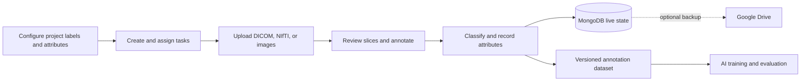
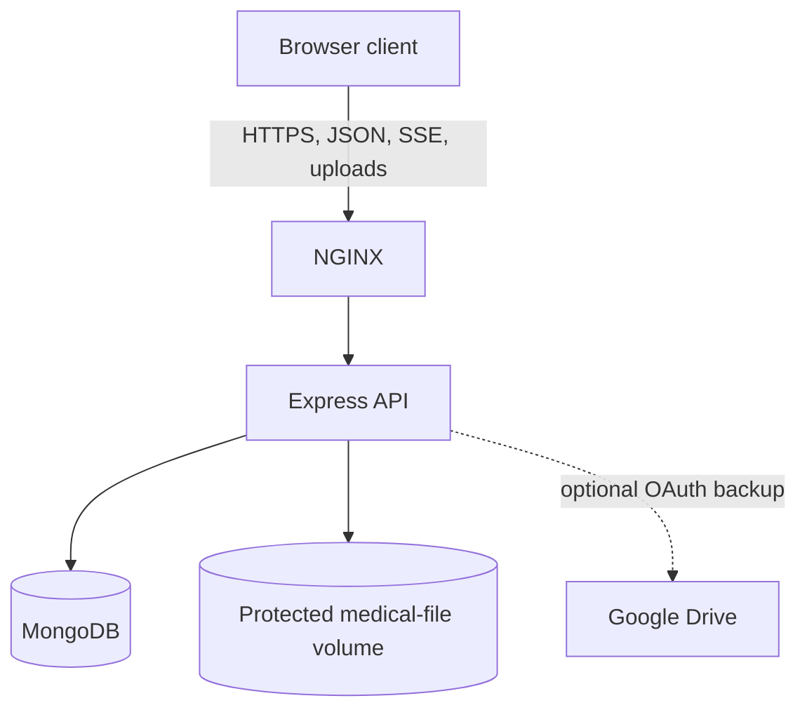

# Medical Image Annotation Platform

`React` `Node.js` `Express` `MongoDB` `Docker` `DICOM` `NIfTI`

A secure, collaborative workspace for reviewing medical images, creating structured annotations, coordinating annotation teams, and producing traceable datasets for clinical research and machine-learning workflows.

> **Project status:** Active development. The repository includes a production-shaped security and deployment foundation, but operators must complete the controls in [SECURITY.md](SECURITY.md) before processing patient data.

## What It Provides

| Area | Capabilities |
| --- | --- |
| Medical imaging | DICOM series, NIfTI volumes, PNG and JPEG; axial, coronal, and sagittal review |
| Annotation | Bounding boxes, polygons, polylines, ellipses, brush masks, editable vertices, labels, and overlay opacity |
| Clinical review | Slice navigation, window center/width, region zoom, classifications, structured attributes, and session timer |
| Dataset creation | Standardized image-pixel geometry, one-based slice numbers, semantic labels, classifications, attributes, revisions, and integrity hashes |
| Project operations | Projects, tasks, priorities, progress, subsets, owners, assignees, configurable labels, and attribute schemas |
| Collaboration | User and team assignment, realtime annotation update notices, per-file/per-slice persistence, and unsaved-change protection |
| Language support | English, German, Dutch, and Persian with right-to-left support |
| Storage | MongoDB as the live source of truth; optional Google Drive backup for files, snapshots, and exports |
| Deployment | Local Node.js workflow, secure Docker Compose stack, and multi-architecture GHCR image publishing |
| Security | Scoped authorization, protected file streaming, upload validation, audit events, rate limits, security headers, encrypted OAuth tokens, and secret-file support |

## Annotation And ML Signals

The platform collects structured final-state supervision that can support dataset curation, supervised learning, quality review, and imitation-learning research:

| Signal | Captured data |
| --- | --- |
| Geometry | Shape type, image-pixel coordinates, dimensions, and slice number |
| Semantics | Label, slice classification, and project-defined attributes |
| Context | Project, task, medical file, and slice |
| Provenance | Creator, last editor, timestamps, revision, schema version, and SHA-256 integrity |
| Effort | Per-user task session time |

Current scope captures annotation outcomes and timing. It does not record every pointer movement or keyboard action as an action trajectory.

Saved slices use the versioned `medical-image-annotation.v1` schema and one-based indexing:

```yaml
1:
  schemaVersion: medical-image-annotation.v1
  sliceNumber: 1
  sliceIndexBase: 1
  coordinateSystem: image-pixel
  annotations: []
  classification:
    value: positive
    scope: slice
  attributes: {}
```

## Workflow

The diagram and feature tables replace screenshots and GIFs. They remain searchable, lightweight, and easier to keep synchronized with the product.



## Architecture



- The React client provides the clinical workspace and project workflows.
- Express enforces authentication, resource authorization, validation, audit logging, and file access.
- MongoDB stores live users, projects, tasks, teams, timers, and annotations.
- Google Drive is optional backup/export storage and never replaces MongoDB as the live database.

## Quick Start

### Docker

Requires Docker Engine or Docker Desktop with Compose v2.

```bash
npm run docker:env
npm run docker:config
npm run docker:build
npm run docker:up
```

Open `http://localhost:3000`.

`docker:env` creates an ignored `.env.docker` file with random local secrets and refuses to overwrite an existing file. MongoDB and uploaded files persist in named volumes.

Stop without deleting data:

```bash
npm run docker:down
```

Do not run `docker compose down -v` unless permanent deletion is intended.

### Local Development

Requirements: Node.js 18+, npm, and MongoDB 4+.

```bash
chmod +x setup.sh
./setup.sh
```

Then use separate terminals:

```bash
npm run server
npm run client
```

Frontend: `http://localhost:3000`

API: `http://localhost:5000`

## Published Images

Pushing a `v*` Git tag runs [.github/workflows/docker-publish.yml](.github/workflows/docker-publish.yml) and publishes AMD64/ARM64 client and server images to GitHub Container Registry.

Set `CLIENT_IMAGE` and `SERVER_IMAGE` in `.env.docker`, then run:

```bash
docker compose --env-file .env.docker pull
docker compose --env-file .env.docker up -d --no-build
```

## Configuration

Copy [server/.env.example](server/.env.example) for non-Docker deployments.

| Variable | Purpose |
| --- | --- |
| `MONGO_URL`, `MONGO_DB_NAME` | Live database connection |
| `JWT_SECRET` | Access-token signing secret |
| `DATA_ENCRYPTION_KEY` | AES-256-GCM protection for Google OAuth credentials |
| `CLIENT_BASE_URL`, `CORS_ORIGINS` | Trusted browser origin |
| `ENFORCE_HTTPS` | Reject non-HTTPS API requests behind a trusted proxy |
| `MAX_UPLOAD_FILE_BYTES`, `MAX_UPLOAD_FILES` | Upload resource limits |
| `GOOGLE_CLIENT_ID`, `GOOGLE_CLIENT_SECRET` | Optional Drive integration |

Mounted secrets can use the supported `_FILE` variants. Production startup rejects weak JWT and unsafe CORS configuration.

## Security Boundary

Implemented controls include:

- JWT purpose, issuer, audience, algorithm, and expiry checks;
- project/task authorization on APIs, files, timers, annotations, and realtime events;
- non-public medical-file storage with authenticated streaming;
- extension, signature, size, and executable-file upload checks;
- CORS restrictions, rate limits, request limits, CSP, HSTS, and other security headers;
- annotation integrity hashes, revisions, audit records, and one-time OAuth state;
- AES-256-GCM OAuth token encryption;
- non-root, read-only containers, private MongoDB networking, and mounted secrets.

Clinical deployment still requires TLS, encryption at rest, MFA or enterprise SSO, malware scanning, DICOM de-identification, managed secrets, backups, monitoring, incident response, penetration testing, and the applicable organizational agreements.

Read [SECURITY.md](SECURITY.md) and the current [security audit record](docs/SECURITY_AUDIT.md). These documents are technical guidance, not HIPAA, GDPR, or ISO 27001 certification.

## Verification

```bash
npm test --prefix server
npm run test:client
npm run build --prefix client
npm audit --omit=dev --prefix server
```

CI also builds both Docker images and runs dependency checks through [.github/workflows/security-checks.yml](.github/workflows/security-checks.yml).

## Repository Map

```text
client/                 React application and medical viewers
server/                 Express API, routes, security, and services
docker/                 MongoDB initialization
scripts/                Local deployment helpers
.github/workflows/      Security checks and image publishing
compose.yaml            Full container stack
SECURITY.md             Security policy and deployment controls
docs/SECURITY_AUDIT.md  Current dependency and residual-risk record
```

## License

No license is currently included. Add an approved license before public distribution.
